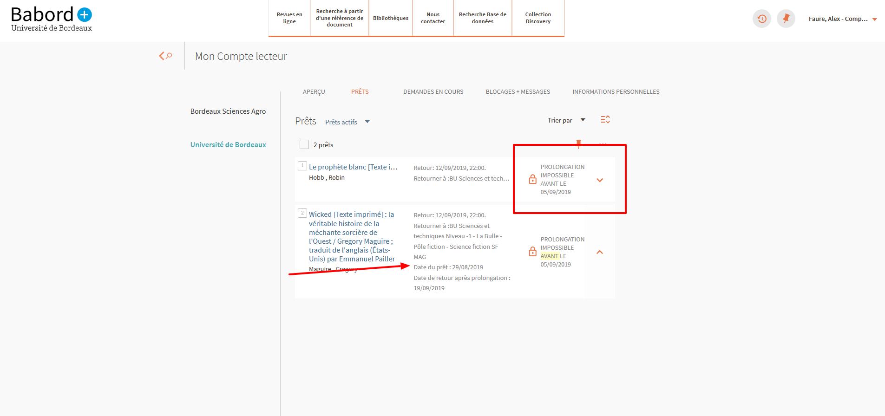

# itemInLOan
## Empêche la réservation si l'emprunt date d'il y a moins de 7 jours (durée maximale de prolongation dans le réseau)
Si le document est prolongeable et que le prêt est un prêt de plus de 7 jours (variable à adapter selon les besoins), le script regarde si le prêt à eu lieu il y a plus de  jours. Si ce n'est pas le cas, il indique quand le document pourra être prolongé.

## Supprime des informations inutiles dans la liste des exemplaires empruntés
Ne sont conservées que la date d'emprunt et la date de retour à l'issue de la prolongation.
