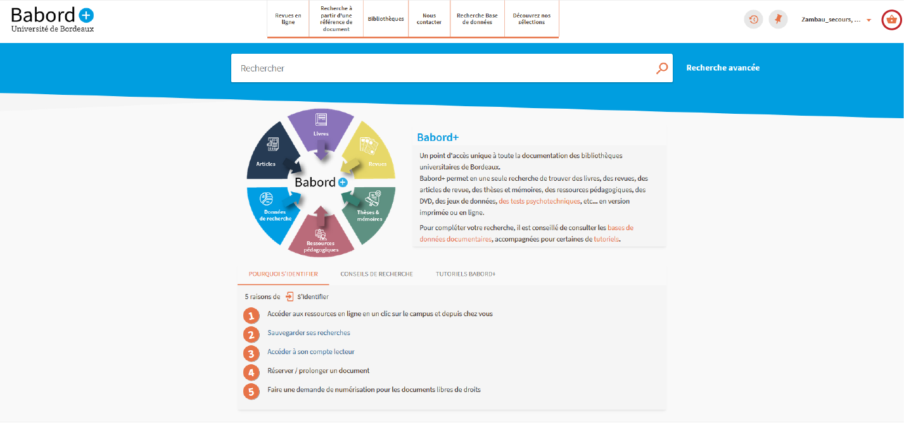

# Mise en oeuvre du clique et collecte bordelais : lien vers la prise de rdv

## panier
Ajoute un bouton panier dans le menu de l'utilisateur lorsque celui-ci est authentifié. Ce bouton permet de rediriger l'usager vers la page de prise de rdv de l'application de gestion du clique et collecte.

 

## panierCompteLecteur
Ajoute un  lien vers l'application de prise de rdv dans l'onglet réservation du compte lecteur
[lien vers démo loom](https://www.loom.com/share/9a466ce8887846d4aa1b606c1d2cccc9)
